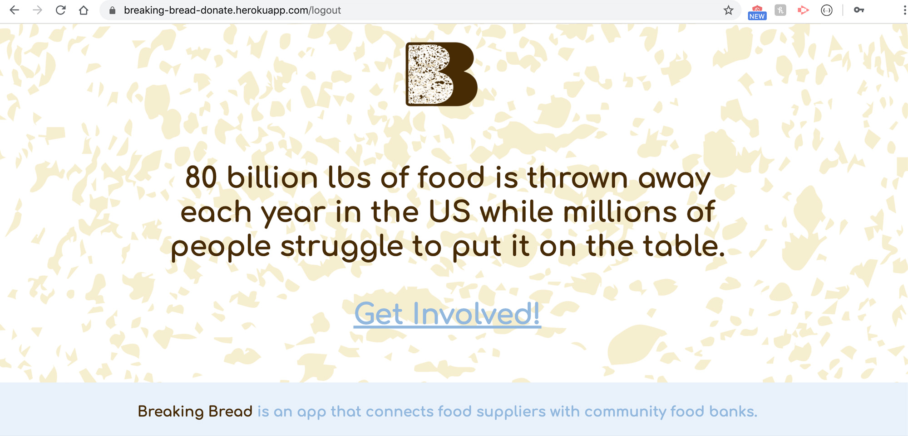
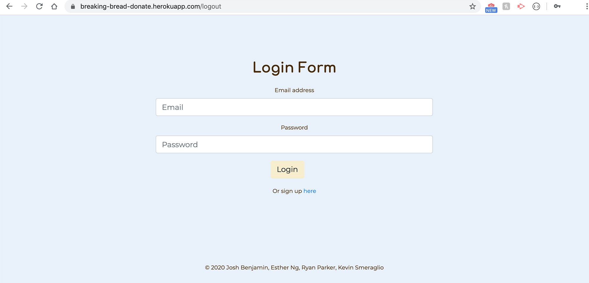
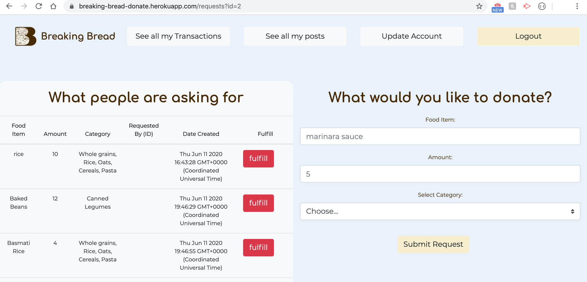
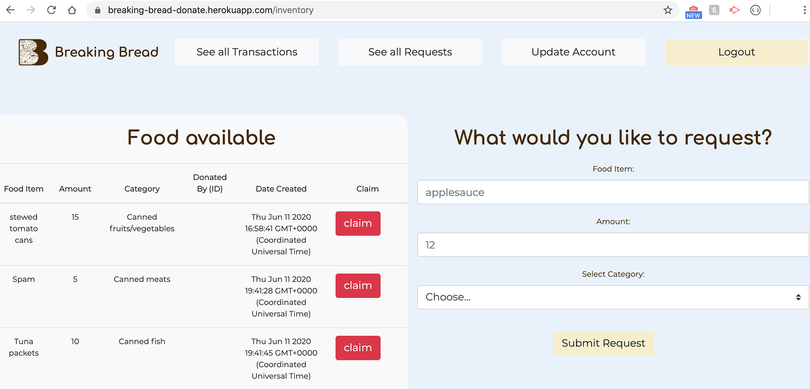

# Breaking-Bread

------------------
## Table of contents

1. [About](#about)
2. [Inspiration](#inspiration)
3. [Usage](#usage)
4. [Screenshots](#screenshots)
5. [Technologies](#technologies)
6. [Setup](#setup)
7. [Links](#links)
8. [To-do List](#todo)
9. [Status](#status)
10. [Credits](#credits)

------------------
## About 

A platform that connects restaurants and supermarkets to charitible food organizations to divert excess resources to those who need it most, reduce food waste, and alleviate food insecurity. 

------------------
## Inspiration 

> “Americans toss out, on average, 72 billion pounds of safe, edible food each year. Around 52 billion of those pounds flow from manufacturers, restaurants, and grocery stores into landfill.” -—Eillie Anzilotti, *Fast Company*

As the coronavirus (COVID-19) continues to threaten people around the world, here in the United States, millions of Americans are out of work and in need of assistance, and as crucially as any other consideration, physical sustenance. And while food waste in the United States is no new issue, the current record-levels of national unemployment make hardship far worse for many more people. 

Restaurants and grocers routinely throw out enormous amounts of perfectly healthy food, and have for decades, while a number of countries around the globe have policies in place that practically forbid that exact type of activity. France was the first to enact such laws; along with nations like Canada, Finland, Rwanda, and Hungary, it continues to set the global standard for curbing food waste. The United States, on the other hand, is woefully average by the same metrics. That said, it has been making remarkable strides towards curbing hunger here via the elimination of food waste (source: https://foodsustainability.eiu.com/country-ranking/).  

So in these unprecedented, challenging times, why not share surplus foodstuffs with those in need? And why not continue that pattern of humanitarian sustainability after the threat of the novel COVID-19 virus has been defeated?

With those thoughts and questions in mind, we have developed this web application. We are thrilled to deploy it for your use, and thank you in advance for fighting hunger. Keep on reading!

------------------
## Usage 

### Food Suppliers
* Create an membership account/log in
* Add member general and contact information
* Add donations to database: food type, description, amount
* View a list of requests from Food Banks

### Food Banks
* Create an membership account/log in
* Add member general and contact information
* View food inventory
* Claim items from food inventory
* Request items not in inventory

------------------
## Screenshots 
First Page: 

Login: 

Supplier Donations: 

Charity Requests: 

------------------
## Technologies 

* Express
* Passport
* MySQL
* Sequelize
* HandleBars
* Bootstrap

------------------
## Setup 

Describe how to install / setup your local environment / add link to demo version.

------------------
## Links 

* heroku: [https://breaking-bread-donate.herokuapp.com/](https://breaking-bread-donate.herokuapp.com/)
* github: [https://github.com/ksmera01/Breaking-Bread](https://github.com/ksmera01/Breaking-Bread)

------------------
## To-do list (future additions): 

* Search/ filter requests (by location/ amount/ food type etc.)
* Add info on delivery/pickup preferences, distance radius, accept EBT/ WIC/ SNAP, tax identification number
* View map of requests
* Use Yelp API to calculate charities' distance

------------------
## Status 

Project is: in progress.

------------------
## Credits 

We appreciate all of our classmates who added their insights to our code. 

Great thanks go to our tutors who have consistently and sincerely sought to help us: Meguel Chavez, Justin Rice, and Simon Rennocks.

As always, we owe a huge debt of gratitude to our Teaching Assistants and Instructor, Tom Woods, Artan "Tani" Muzhaqi, and Anthony "Ant" Briglia for all of their assistance while they were both on and off duty (so to speak).

## Copyright and Collaborators

© 2020 Josh Benjamin, Esther N, Ryan Parker, Kevin Smeraglio
